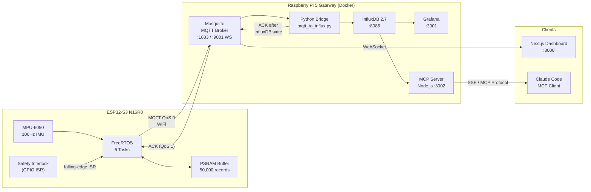
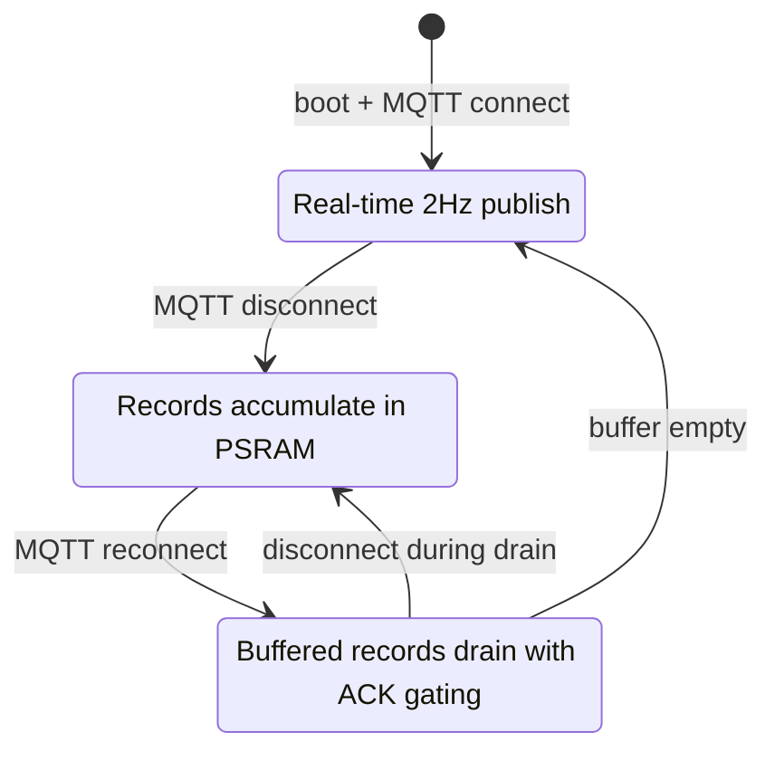
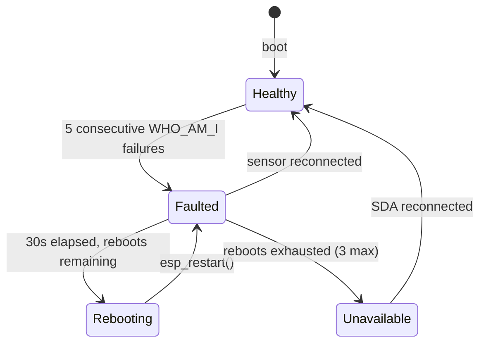

# Industrial Sensor Pipeline

[](https://github.com/markPVale/industrial-sensor-pipeline/actions/workflows/ci.yml)

End-to-end industrial vibration monitoring system: ESP32-S3 firmware &rarr; MQTT &rarr; InfluxDB &rarr; Grafana, with ACK-gated store-and-forward delivery, graduated fault recovery, and an AI query layer via Model Context Protocol.

An ESP32-S3 samples a 6-axis IMU at 100Hz, applies Kalman filtering, detects vibration anomalies, and streams telemetry to a Raspberry Pi gateway with safety interlock support. A Model Context Protocol server on the Pi lets Claude Code query live sensor data in plain English — _"Is my sensor healthy? Were there any anomalies in the last hour?"_

## Validation Results

Hardware validation on Raspberry Pi 5 + ESP32-S3:

- Baseline run: 234 records, 0 sequence gaps per `integrity_check.py`, timestamp monotonicity PASS, data fidelity PASS.
- Controlled Mosquitto broker outage/restart: 570 records, 0 sequence gaps per `integrity_check.py`, timestamp monotonicity PASS, data fidelity PASS.
- ACK path confirmed over MQTT: each telemetry record received a matching `sensor/node01/ack` after the bridge wrote it to InfluxDB.
- MCP tools validated against live InfluxDB data: latest telemetry, health summary, and recent anomalies.

## Why This Matters

I started this expecting the hard part to be the dashboards. It was not. The hard part was that the sensor lies and the network drops, and almost nothing in a typical tutorial pipeline accounts for either.

A real MPU-6050 does not always fail loudly. Yank the SDA line mid-transaction and it can hang in a state that survives a firmware restart while the sensor remains powered, then quietly returns zeros that look like a machine sitting still. WiFi drops for ninety seconds and a naive pipeline loses those ninety seconds forever. Most monitoring projects assume the broker is always up and the sensor is always honest. Run one in the field for an afternoon and both assumptions break.

So this project is built backwards from the failures. Buffer when the link dies. Refuse to drop a record until the gateway confirms it landed in the database. Tell the difference between a dead sensor and a quiet one. That reliability layer between a physical sensor and a dataset you would actually trust is the boring problem that has to be solved before "AI on real-world data" means anything, and it is the part I'm most interested in.

## Architecture



## Hard Problems Solved

### Store-and-forward with app-level acknowledgements

Records buffer in 8MB PSRAM (up to 50,000 &times; 48 bytes) during WiFi outages and drain on reconnect. The bridge ACKs each record _after_ writing it to InfluxDB, and the firmware only pops the buffer on a matching ACK — closing the gap between "MQTT accepted the publish" and "the data is actually persisted." Validated with controlled broker-outage tests and an end-to-end sequence integrity checker.



### I2C fault recovery under hostile conditions

An SDA hot-unplug leaves the MPU-6050's I2C state machine stuck mid-transaction — a state that survives power-to-the-sensor. The firmware runs 9-pulse SCL clock recovery, `PWR_MGMT_1 DEVICE_RESET` on every boot, and a graduated fault escalation: 5 consecutive WHO_AM_I failures &rarr; `DEGRADED` (auto-reboot pending) &rarr; 3 bounded reboots &rarr; `UNAVAILABLE` (power-cycle required). Full in-session recovery on SDA reconnect. Hardware-validated.



### Platform gotchas discovered and solved

- **`RTC_DATA_ATTR` is unreliable on ESP32-S3 / Arduino-ESP32** — `esp_restart()` resets RTC slow memory, causing an infinite reboot loop. Replaced with NVS storage and an `esp_reset_reason()` guard.
- **MQTT callbacks must stay minimal on ESP32-S3** — USB CDC and WiFi share interrupt resources. Callbacks only set event bits; all state transitions and Serial I/O happen in a dedicated task.
- **`express.json()` silently breaks MCP SSE** — the middleware consumed POST bodies before the MCP handler could read them.

## Firmware Design

Six FreeRTOS tasks across two cores:

| Task | Core | Priority | Role |
|------|------|----------|------|
| `safetyTask` | 0 | 6 | ISR handler — latches interlock, publishes E-Stop |
| `sensorTask` | 1 | 5 | 100Hz MPU-6050 sampling via `vTaskDelayUntil` |
| `filterTask` | 1 | 5 | 6&times; Kalman filters, rolling RMS, anomaly detection |
| `connectionTask` | 0 | 4 | Sole MQTT socket owner, drains publish queue |
| `telemetryTask` | 0 | 3 | Enqueues oldest buffered telemetry at 2Hz |
| `syncTask` | 0 | 3 | Drains PSRAM buffer on reconnect |

## Tech Stack

| Layer | Technology |
|-------|-----------|
| Firmware | C++, FreeRTOS, Arduino-ESP32, PlatformIO |
| Transport | MQTT (PubSubClient) |
| Gateway | Python 3.12, paho-mqtt, influxdb-client |
| Storage | InfluxDB 2.7, Flux |
| Visualization | Grafana, Next.js (MQTT WebSocket) |
| AI interface | Node.js, TypeScript, Model Context Protocol SDK |
| Infrastructure | Docker Compose, Raspberry Pi 5 |

## Hardware

| Component | Details |
|-----------|---------|
| MCU | ESP32-S3-DevKitC-1 N16R8 (16MB flash, 8MB OPI PSRAM) |
| IMU | MPU-6050 at I2C address 0x68 |
| Safety interlock | Photoresistor on GPIO 10, falling-edge ISR |
| Gateway | Raspberry Pi 5 |

## Repository Structure

```
industrial-sensor-pipeline/
├── firmware/                   # ESP32-S3 PlatformIO project
│   ├── src/main.cpp            # FreeRTOS tasks, state machine, MQTT
│   ├── include/
│   │   ├── config.h            # Pin assignments, sample rate, buffer capacity
│   │   └── types.h             # TelemetryRecord, NodeState, status flags
│   └── lib/
│       ├── BufferManager/      # PSRAM ring buffer (50,000 records, mutex-protected)
│       ├── KalmanFilter/       # 1D scalar Kalman filter (6 instances per node)
│       └── MqttManager/        # WiFi + PubSubClient, exponential reconnect backoff
├── gateway/
│   ├── docker-compose.yml      # Mosquitto, InfluxDB 2.7, Grafana
│   ├── config/mosquitto.conf
│   └── bridge/
│       ├── mqtt_to_influx.py   # MQTT → InfluxDB bridge with ACK publishing
│       ├── integrity_check.py  # End-to-end sequence integrity validator
│       └── mock_esp32.py       # Simulated sensor node for local dev
├── dashboard/                  # Next.js live dashboard (MQTT WebSocket)
├── mcp-server/                 # MCP server — exposes sensor data to Claude Code
└── docs/
    ├── architecture.md         # Mermaid system diagrams
    ├── telemetry-schema.md     # MQTT payload and status flag reference
    └── store-and-forward-status.md
```

## Getting Started

### Gateway (Raspberry Pi)

```bash
cd gateway && docker compose up -d

cd gateway/bridge
python3 -m venv .venv && source .venv/bin/activate
pip install -r requirements.txt
python3 mqtt_to_influx.py
```

### Firmware (ESP32-S3)

```bash
cp firmware/secrets.ini.template firmware/secrets.ini
# Fill in WiFi credentials + broker IP

cd firmware && pio run --target upload
```

### MCP Server

```bash
cd mcp-server && npm install && npm run build
TRANSPORT=sse MCP_PORT=3002 INFLUX_URL=http://localhost:8086 \
  INFLUX_TOKEN=dev-token-change-in-production \
  INFLUX_ORG=industrial INFLUX_BUCKET=sensors \
  node dist/index.js
```

### Integrity Check

```bash
cd gateway/bridge && source .venv/bin/activate
python3 integrity_check.py --minutes 10
```

## Telemetry Schema

Each record published to `sensor/<node_id>/telemetry`:

```json
{
  "boot": 12,
  "seq": 4821,
  "ts": 1714000000000,
  "ax": -0.88, "ay": 0.17, "az": 10.19,
  "gx": -0.07, "gy": -0.15, "gz": -0.05,
  "wrms": 10.1750,
  "flags": 0
}
```

See [`docs/telemetry-schema.md`](docs/telemetry-schema.md) for flag bit definitions.

## Status Flags

| Flag | Value | Meaning |
|------|-------|---------|
| `STATUS_OK` | `0x00` | Normal sample |
| `STATUS_ACCEL_CLIPPED` | `0x01` | Accelerometer hit &plusmn;8g range limit |
| `STATUS_GYRO_CLIPPED` | `0x02` | Gyro hit &plusmn;500&deg;/s range limit |
| `STATUS_INTERLOCK_OPEN` | `0x04` | Safety interlock open at sample time |
| `STATUS_ANOMALY` | `0x08` | Firmware rolling window RMS exceeded threshold |
| `STATUS_SENSOR_FAULT` | `0x10` | I2C probe failed (legacy) |
| `STATUS_DEGRADED_REBOOT_REQUIRED` | `0x20` | I2C fault; auto-reboot pending |
| `STATUS_SENSOR_UNAVAILABLE` | `0x40` | I2C fault; max reboots exhausted |

## Port Reference

| Service | Port |
|---------|------|
| Mosquitto MQTT | 1883 |
| Mosquitto WebSocket | 9001 |
| InfluxDB | 8086 |
| Grafana | 3001 |
| Next.js dashboard | 3000 |
| MCP server (Pi) | 3002 |

## Scope and Limitations

- Single sensor node today; MQTT topics, client ID, and ACK topic are currently configured for `node01`.
- Telemetry publish uses PubSubClient QoS 0; persistence is protected by an app-level ACK after the bridge writes to InfluxDB.
- Store-and-forward capacity is finite: 50,000 records in PSRAM. If the outage lasts longer than the buffer budget, oldest records can be evicted.
- E-Stop events are published separately and are not part of the ACK-gated telemetry buffer.
- The MCP server is a stateless query layer over InfluxDB, not a streaming subscriber.
- No OTA updates, fleet provisioning, or device identity management yet.

## Roadmap

- Multi-node fleet support with dynamic node IDs, per-node ACK topics, and fleet dashboards.
- OTA firmware updates and gateway-managed configuration.
- Calibration drift tracking and fleet-level sensor health reports.
- On-device anomaly model or edge ML path.

## Author

Built by Mark Vale — full-stack engineer working at the hardware, distributed systems, and AI tooling boundary.
LinkedIn: <https://www.linkedin.com/in/markvalestudio/>
