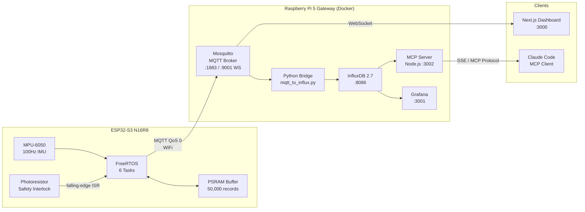
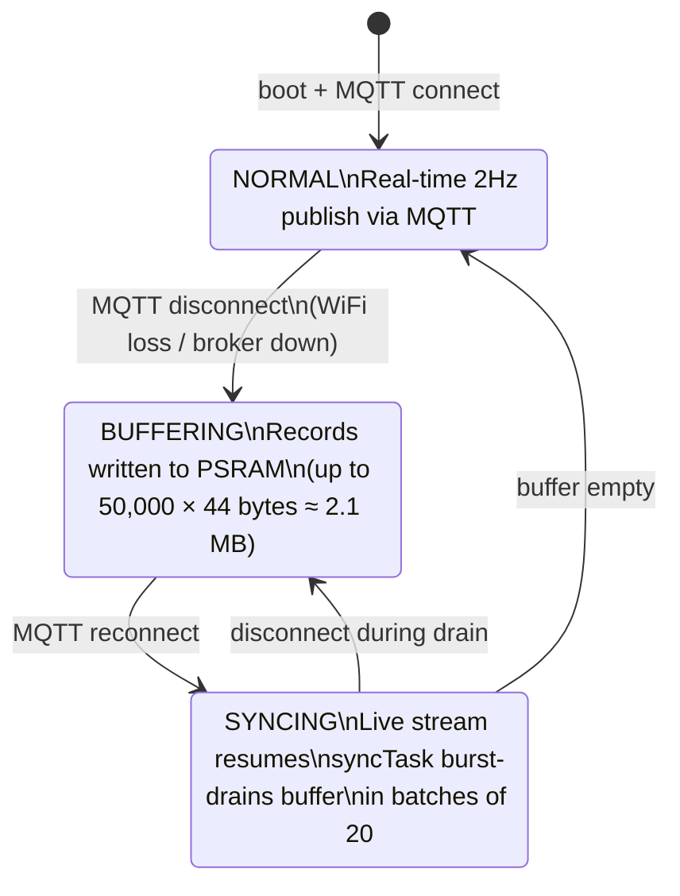
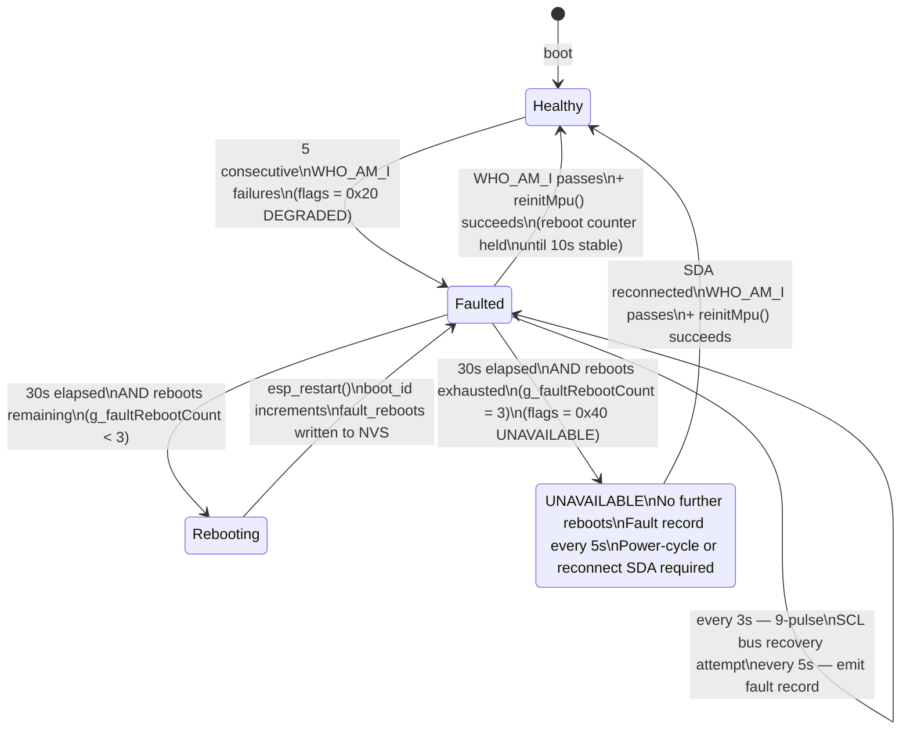

# System Architecture

## Full System

---

## Store-and-Forward State Machine

Minimises data loss through network partitions — records buffer in PSRAM during
outages and drain on reconnect. Not end-to-end guaranteed delivery: QoS 0 publish
and a small in-memory queue between the buffer and the MQTT socket mean a
connection drop mid-drain can lose up to one batch of records. All state is a
single `std::atomic<NodeState>` — no scattered boolean flags.

---

## I2C Fault Escalation

Graduated response to MPU-6050 communication failure (e.g. SDA hot-unplug).
Reboot counter is stored in NVS — persists across `esp_restart()` but clears
on power-cycle or after 10s of sustained healthy operation.

